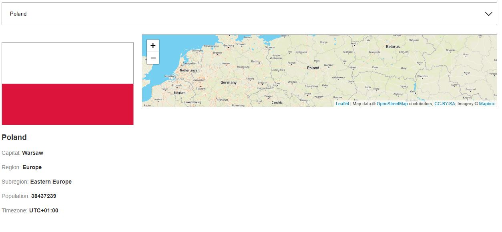

# Fetch API Country map
> In this exercise I download list of countries from API and insert them to select options. Next I download selected country data and show information about actually selected country on page. Finally I added interactive map from Leaflet.js library to currenty selected country.

## API data and map library
> To my exercise I used this API data https://restcountries.eu/rest/v2/ and interactive maps from https://leafletjs.com/

## Screenshots

## Technologies
* HTML
* CSS
* JavaScript
* Fetch API
* GIT
* Leaflet.js

## Status
Project is: *Done*

## Contact
Created by [Damian Jackiewicz](https://www.linkedin.com/in/damian-jackiewicz/) - feel free to contact me!
